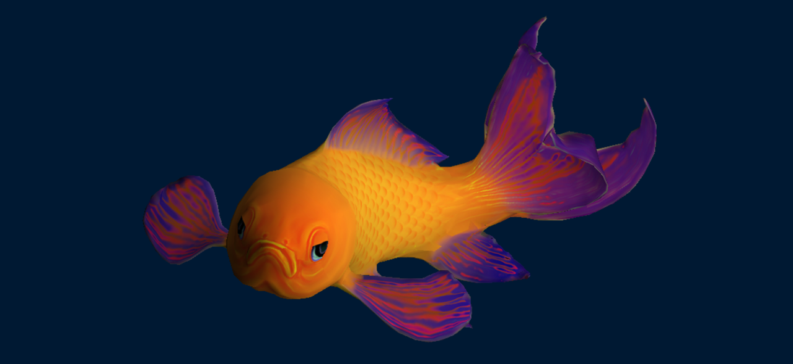

=============
Vulkan Engine
=============

Very basic Vulcan engine which loads and navigates a glTF model. It only uses smooth shading and a diffuse base texture per mesh.
I use this to experiment with Vulkan.
It is based on Imagination Technologies' Vulkan SDK "HelloAPI" example. This is an example very well commented that does most of the boiler plate code in a very straightforward way. I have kept all the original comments as they are very helpful. It also uses IMG's vk_getProcAddrs wrapper which makes very simple linking to the Vulkan libraries. The intention was to have the whole engine as include files (e.g you just include vkEngine.h and all the functionality will be there). This is not quite so yet as I haven't ported vk_getProcAddrs to be include only. 
It also uses `tinyGLTF <https://github.com/syoyo/tinygltf>`_  and `dds-ktx <https://github.com/septag/dds-ktx>`_. tinyGLTF has been modified so it loads as an include file. 

Building
--------
The CMake file is supplied. It also compiles the shaders from source. Just make sure you download and update the path to glslangvalidator. Just build the whole project every time you update the shaders so they get compiled. 
This build is for Windows only (for the moment). 
I use QT Creator to build it straight from the CMake file using MinGW 64-bit compiler. Do not forget to run CMake (Build -> CMake) the first time around.

Controls
--------
Usual controls in a FPS:
- ROTATE- Left Click + Mouse movement
- W- Zoom in
- S- Zoom out
- A- Pan to left
- W- Pan to right
